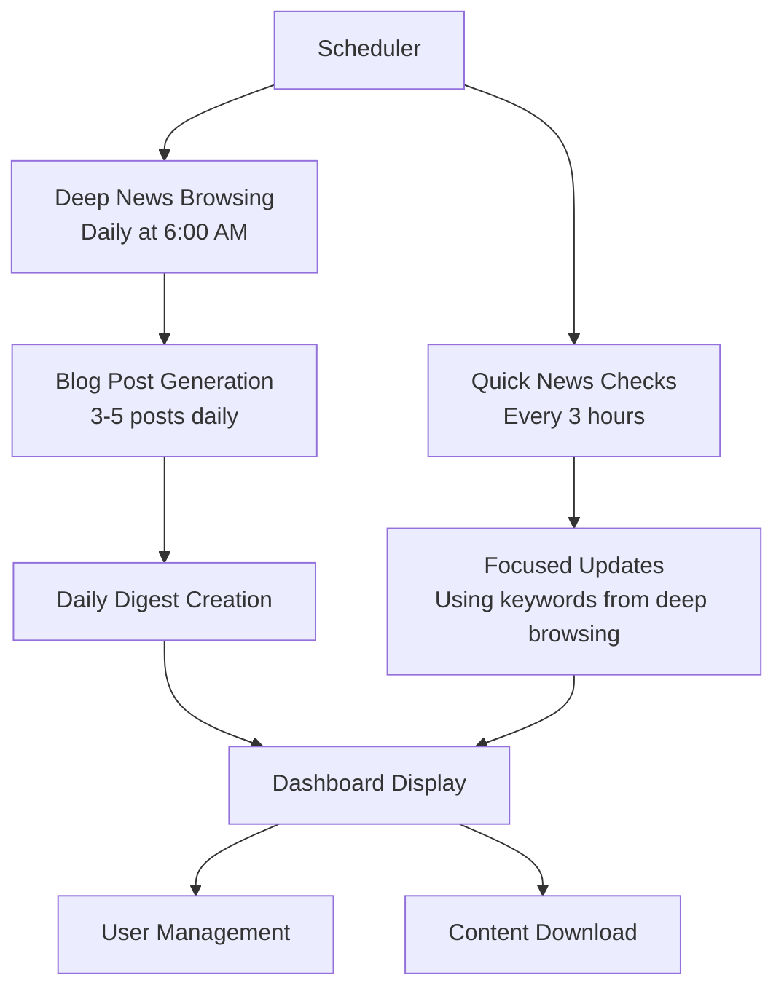

# News Browsing and Content Generation System Redesign

## Overview

This document describes the comprehensive redesign of the news browsing and content generation system for the WhatsApp chatbot platform. The redesign addresses key limitations of the current implementation and introduces a human-like browsing pattern with daily blog post generation capabilities.

## Current System Limitations

1. **Hardcoded News Sources**: Limited flexibility and difficult to maintain
2. **Superficial Content**: Only headlines from front pages without article details
3. **Ineffective Discovery**: 5% random chance discovery rarely finds new sites
4. **No User Control**: No visibility or management of favorite sites
5. **No Content Generation**: No mechanism to create shareable content from news

## Redesigned System Goals

1. **Human-Like Browsing**: Mimic natural news consumption patterns
2. **Content Generation**: Create 3-5 high-quality blog posts daily
3. **User Control**: Full dashboard interface for news source management
4. **Configurable Sources**: Use Google News with user-configurable URLs
5. **Rich Content**: Follow links to read full articles, not just headlines

## System Architecture

### High-Level Flow

## News Browsing Redesign

### Human-Like Browsing Pattern: "Morning Deep Dive + Periodic Check-ins"

#### Deep News Browsing (Daily at 6:00 AM)

- **Purpose**: Comprehensive news gathering and content generation
- **Process**:
  1. Visit configured Google News URLs (HK/US editions)
  2. Scan front page headlines and summaries
  3. Follow 10-15 article links to read full content
  4. Extract keywords, topics, and entities
  5. Store comprehensive news data with full articles
- **Output**: Rich dataset of full articles for blog generation

#### Quick News Checks (Every 3 Hours)

- **Purpose**: Keep news content fresh between deep dives
- **Process**:
  1. Quick scan of Google News front pages
  2. Focus on keywords/topics from morning deep dive
  3. Follow 3-5 most relevant links for full content
  4. Update keyword list with new emerging topics
  5. Store concise updates with key information
- **Output**: Fresh news updates with focused content

### Keyword Tracking System

- **Purpose**: Maintain focus on relevant topics
- **Components**:
  - Keyword database storing topics from deep browsing
  - Relevance scoring for keywords
  - Emerging topic detection
  - User customization for keyword preferences
- **Integration**: Guides quick checks to focus on relevant content

## Blog Post Generation System

### Daily Blog Post Generation

- **Trigger**: Runs automatically after deep news browsing
- **Quantity**: 3-5 blog posts per day
- **Format**: Markdown with proper structure and formatting
- **Content Requirements**:
  - Engaging introduction
  - Proper Markdown formatting (headings, lists, bold, italics)
  - Subheadings to organize content
  - "Key Takeaways" section with bullet points
  - Conclusion section
  - Professional but accessible tone

### Blog Post Selection Algorithm

1. **Filtering**:
   - Articles with sufficient content (>500 words)
   - Articles with meaningful titles (>20 characters)
   - Articles with valid URLs
2. **Scoring**:
   - Content length (longer = better)
   - Presence of images (articles with images score higher)
   - Content quality indicators
3. **Selection**:
   - Top 3-5 articles based on score
   - Random selection within top candidates for diversity

### Content Generation Process

1. **Article Analysis**: Extract key information from source article
2. **Structure Planning**: Create outline for blog post
3. **AI Generation**: Use LLM to rewrite content in blog format
4. **Image Handling**: Extract or generate featured image
5. **Metadata Creation**: Generate excerpt, tags, and category
6. **Quality Check**: Validate content quality and formatting
7. **Storage**: Save blog post to database

### Daily and Weekly Digests

- **Daily Digest**:
  - Generated automatically after blog post creation
  - Contains all blog posts from the day
  - Markdown format with proper structure
  - Available for download from dashboard
- **Weekly Digest**:
  - Generated automatically every Sunday
  - Contains all blog posts from the past week
  - Organized by category
  - Comprehensive overview of weekly news

## Google News Integration

### Primary Source Approach

- **Replaces hardcoded news sources** with configurable Google News URLs
- **Default Configuration**:
  - Google News Hong Kong (English): `https://news.google.com/home?hl=en-HK&gl=HK&ceid=HK:en`
  - Google News Hong Kong (Chinese): `https://news.google.com/home?hl=zh-HK&gl=HK&ceid=HK:zh-Hant`
  - Google News United States: `https://news.google.com/home?hl=en-US&gl=US&ceid=US:en`
- **User Configurable**: URLs can be added/removed via dashboard

### Article Following Capability

- **Front Page Scraping**: Extracts article links from Google News front pages
- **Content Extraction**: Follows links to read full articles
- **Mobile Optimization**: Uses mobile view for better content extraction
- **Error Handling**: Robust handling of broken links and inaccessible content

## Discovery Mechanism Redesign

### Smart Source Expansion

- **Trigger**: Runs during deep news browsing
- **Process**:
  1. Extract domains from article URLs in Google News
  2. Validate if domains are legitimate news sources
  3. Present discovered sources to users for approval
  4. Add approved sources to user favorites
- **Validation Criteria**:
  - News-related keywords in content
  - Presence of date elements
  - Number of article links
  - News section indicators
  - AI validation for content analysis

### User Confirmation Workflow

1. **Discovery**: System identifies potential news sources
2. **Validation**: System validates source quality
3. **Presentation**: Discovered sources shown in dashboard
4. **User Action**: User approves or rejects sources
5. **Integration**: Approved sources added to favorites

## Dashboard Redesign

### News Sources Management

- **Google News Configuration**:
  - Add/remove Google News URLs
  - Configure language and region settings
  - Set priority for different editions
- **User Favorites Management**:
  - Add/remove favorite news sites
  - Categorize favorites
  - View and manage discovered sources

### Blog Post Management

- **Daily Digest View**:
  - Browse all posts from a specific day
  - Date navigation controls
  - Visual calendar for date selection
- **Blog Post Cards**:
  - Title and featured image
  - Excerpt and metadata
  - Source attribution
  - Action buttons (view, edit, delete, publish/unpublish)
- **Full Post Viewer**:
  - Modal dialog with full content
  - Proper Markdown rendering
  - Image display with captions
- **Download Options**:
  - Download daily digest as markdown
  - Download individual posts
  - Download weekly digest

### Browsing Schedule Configuration

- **Deep Browsing Schedule**: Set time for daily deep dive (default: 6:00 AM)
- **Quick Check Frequency**: Set interval for quick checks (default: every 3 hours)
- **Blog Generation Schedule**: Set time for blog post generation

## Data Model Enhancements

### Blog Post Data Model

- **Content**: Markdown formatted blog post content
- **Metadata**: Title, excerpt, source information
- **Images**: Featured image with alt text and caption
- **Taxonomy**: Tags and category
- **Timestamps**: Publication date, creation date
- **Status**: Draft, published, archived
- **Authorship**: Author information

### Digest Data Model

- **Daily Digest**:
  - Date
  - Title
  - Content (markdown)
  - Associated blog posts
- **Weekly Digest**:
  - Date range
  - Title
  - Content (markdown)
  - Associated blog posts
  - Category organization

## Implementation Workflow

### Daily Cycle

1. **6:00 AM**: Deep news browsing begins
2. **6:30 AM**: Blog post generation triggered
3. **6:45 AM**: Daily digest created and available in dashboard
4. **9:00 AM**: First quick news check
5. **Every 3 hours**: Quick news checks continue
6. **Next day**: Cycle repeats

### Weekly Cycle

1. **Sunday 8:00 AM**: Weekly digest generation
2. **Sunday 8:30 AM**: Weekly digest available in dashboard

## User Experience

### Dashboard Interface

- **Responsive Design**: Works on desktop and mobile devices
- **Intuitive Navigation**: Clear menu structure
- **Visual Indicators**: Status indicators for blog posts
- **Action Controls**: Buttons for common actions
- **Date Navigation**: Easy movement between different days

### Content Consumption

- **Web Interface**: View blog posts in dashboard
- **Download Options**: Get content in markdown format
- **Email Notifications**: Optional email digests
- **RSS Feed**: For integration with other platforms

## Benefits of the Redesigned System

1. **Rich Content**: Full articles instead of just headlines
2. **Professional Output**: High-quality blog posts in markdown format
3. **Time Savings**: Automated content generation
4. **User Control**: Full management of news sources and content
5. **Configurability**: Flexible system that adapts to user needs
6. **Human-Like Behavior**: Natural news consumption patterns
7. **Continuous Discovery**: Effective source discovery mechanism
8. **Comprehensive Coverage**: Daily and weekly digests for easy consumption

## Migration Strategy

1. **Phase 1**: Implement core blog generation infrastructure
2. **Phase 2**: Develop dashboard interface
3. **Phase 3**: Migrate from old news service to Google News
4. **Phase 4**: Implement discovery mechanism
5. **Phase 5**: Add enhanced features and polish

## Monitoring and Maintenance

1. **Generation Logs**: Track successful/failed blog post generation
2. **Content Quality**: Monitor blog post quality metrics
3. **User Engagement**: Track dashboard usage and content downloads
4. **Error Tracking**: Monitor scraping and generation errors
5. **Performance Metrics**: Track system performance and resource usage
