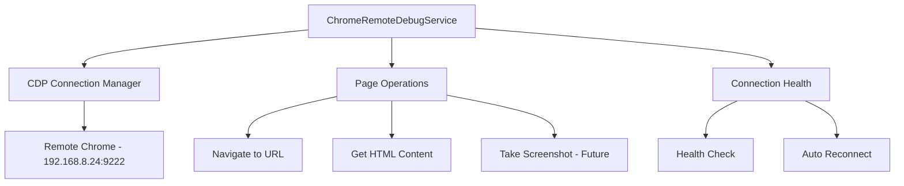

# Chrome Remote Debug Service Plan

## Overview

A service to control a Chrome browser via Chrome DevTools Protocol (CDP) at a remote endpoint (`192.168.8.24:9222`). This allows using manually configured browser sessions (cookies, logins, etc.) while automating navigation and content extraction.

## Architecture



## Key Components

### 1. ChromeRemoteDebugService Class

Main service class that manages the connection and provides high-level operations.

```typescript
class ChromeRemoteDebugService {
  private browser: Browser | null;
  private context: BrowserContext | null;
  private page: Page | null;
  private endpoint: string;
  
  constructor(config: ChromeRemoteDebugConfig);
  async connect(): Promise<void>;
  async disconnect(): Promise<void>;
  isConnected(): boolean;
  async healthCheck(): Promise<HealthStatus>;
  
  // Core operations
  async navigate(url: string, options?: NavigateOptions): Promise<NavigateResult>;
  async getHtmlContent(): Promise<string>;
  async navigateAndGetContent(url: string): Promise<PageContent>;
  
  // Advanced operations
  async newPage(): Promise<Page>;
  async switchToPage(index: number): Promise<Page>;
  async getAllPages(): Promise<Page[]>;
  async evaluate<T>(script: string): Promise<T>;
  async screenshot(options?: ScreenshotOptions): Promise<Buffer>;
  async waitForSelector(selector: string, timeout?: number): Promise<void>;
}
```

### 2. Type Definitions

```typescript
interface ChromeRemoteDebugConfig {
  endpoint: string;          // CDP endpoint e.g. http://127.0.0.1:9222
  timeout?: number;          // Navigation timeout in ms
  retries?: number;          // Connection retry count
}

interface NavigateOptions {
  timeout?: number;          // Page load timeout
  waitUntil?: 'load' | 'domcontentloaded' | 'networkidle';
}

interface NavigateResult {
  success: boolean;
  url: string;               // Final URL after redirects
  title: string;
  statusCode?: number;
}

interface PageContent {
  url: string;
  title: string;
  html: string;
  timestamp: Date;
}
```

## Implementation Details

### Connection Strategy

1. Use Playwright's `chromium.connectOverCDP()` to connect to remote Chrome
2. Get or create a page/context from the connected browser
3. Handle connection failures with retry logic

### Error Handling

- Connection refused: Retry with exponential backoff
- Navigation timeout: Return error with partial content if available
- Page crash: Attempt to create new page

## Usage Examples

### Basic Usage

```typescript
import { ChromeRemoteDebugService } from './services/ChromeRemoteDebugService';

// Create service
const chromeService = new ChromeRemoteDebugService({
  endpoint: 'http://127.0.0.1:9222',
  timeout: 30000,
  retries: 3
});

// Connect to remote Chrome
await chromeService.connect();

// Navigate and get content
const content = await chromeService.navigateAndGetContent('https://example.com');
console.log(content.title);
console.log(content.html);

// Disconnect when done
await chromeService.disconnect();
```

### Using Environment Variables

```typescript
import { createChromeRemoteDebugServiceFromEnv } from './services/ChromeRemoteDebugService';

// Set environment variables:
// CDP_ENDPOINT=http://127.0.0.1:9222
// CDP_TIMEOUT=30000
// CDP_RETRIES=3

const chromeService = createChromeRemoteDebugServiceFromEnv();
await chromeService.connect();
```

### Health Check

```typescript
const health = await chromeService.healthCheck();
if (health.healthy) {
  console.log(`Connected to Chrome ${health.browserVersion}`);
  console.log(`Contexts: ${health.contextCount}, Pages: ${health.pageCount}`);
}
```

### Multi-Page Navigation

```typescript
// Create a new page
const page2 = await chromeService.newPage();

// Switch between pages
await chromeService.switchToPage(0);  // First page
await chromeService.switchToPage(1);  // Second page

// Get all pages
const allPages = await chromeService.getAllPages();
console.log(`${allPages.length} pages open`);
```

### Execute JavaScript

```typescript
// Execute JavaScript in the current page
const title = await chromeService.evaluate<string>('document.title');
const links = await chromeService.evaluate<string[]>('Array.from(document.links).map(a => a.href)');
```

### Take Screenshot

```typescript
// Take a screenshot
const screenshot = await chromeService.screenshot({ fullPage: true });
fs.writeFileSync('screenshot.png', screenshot);
```

### Wait for Dynamic Content

```typescript
// Navigate and wait for specific content
await chromeService.navigate('https://example.com');
await chromeService.waitForSelector('.content-loaded', 10000);
const html = await chromeService.getHtmlContent();
```

## Files Created

| File | Description |
|------|-------------|
| `src/services/ChromeRemoteDebugService.ts` | Main service implementation |
| `src/types/chromeRemoteDebug.ts` | Type definitions |
| `test/services/chromeRemoteDebugService.test.ts` | Unit tests |
| `scripts/test-chrome-remote-debug.ts` | Integration test script |

## Dependencies

- `playwright` - Already in package.json, provides CDP connection via `chromium.connectOverCDP()`

## Future Enhancements

- Screenshot capture ✅ (implemented)
- PDF generation
- Form interaction
- Event monitoring (network, console)
- Cookie/session management helpers
