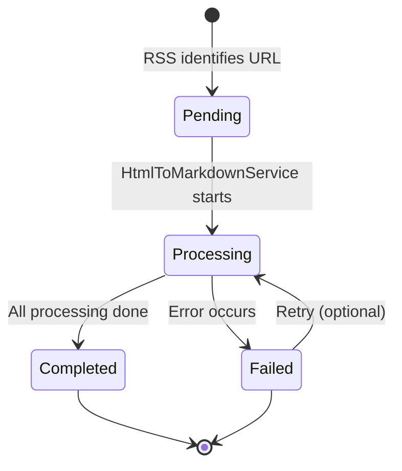
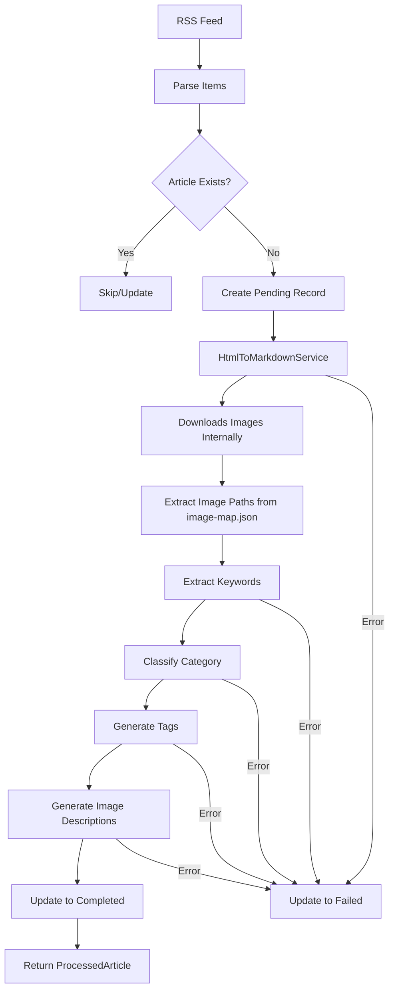

# Google Search Service Redesign Plan

## Overview
This plan outlines the redesign of the GoogleSearchService to return processed articles with enhanced features merged from GoogleNewsService.

**Note**: HtmlToMarkdownService already handles image downloading internally using curl. We will NOT use ImageDownloadService - instead, we'll leverage the images already downloaded by HtmlToMarkdownService.

## Current State Analysis

### GoogleSearchService
- Returns `SearchResult[]` with: title, link, snippet, image, pubDate, feedUrl, originalLink, fullText
- Has `searchNews()`, `searchNewsGrouped()`, `searchNewsFull()`, `searchNewsGroupedFull()` methods
- Uses HtmlToMarkdownService for fetching full articles
- Image handling: single `image` field (URL string)
- **Note**: HtmlToMarkdownService already downloads images internally using curl to `data/html/cache/YYYY-MM-DD/hash/images/`

### GoogleNewsService
- Returns `GoogleNewsArticle[]` with: title, url, source, publishedAt, description, fullContent, category, keywords
- Has keyword extraction using LLM
- Uses WebScrapeService for content extraction
- Has fallback keyword extraction

### ProcessedArticleService
- Manages `ProcessedArticle` records in database
- Fields: title, url, source, publishedAt, originalContent, processedContent, imagePaths, imageDescriptions, keywords, category, processingStatus
- Status enum: pending, processing, completed, failed

### Schema (ProcessedArticle)
```prisma
model ProcessedArticle {
  id                String   @id @default(uuid())
  title             String
  url               String   @unique
  source            String
  publishedAt       String
  originalContent   String   // Currently stores raw content
  processedContent  String   // Currently stores markdown
  imagePaths        String[] // Array of downloaded image file paths
  imageDescriptions Json?    // Vision LLM descriptions for each image
  keywords          String[]
  category          String?
  processingStatus  ProcessedArticleStatus @default(completed)
  createdAt         DateTime @default(now())
  updatedAt         DateTime @updatedAt
}
```

**Note**: HtmlToMarkdownService downloads images to `data/html/cache/YYYY-MM-DD/hash/images/` and stores relative paths in markdown as `images/filename.jpg`

## Requirements & Changes

### 1. Field Mapping Corrections
- `originalLink` → `source` (the original RSS/feed URL that produced this item)
- `feedUrl` → New field for the RSS URL (normalized, without locale params)

### 2. Image Handling Enhancement
- Replace single `image` field with `imagePaths` (array of downloaded image paths)
- **Use images already downloaded by HtmlToMarkdownService** (no need for ImageDownloadService)
- HtmlToMarkdownService downloads images to `data/html/cache/YYYY-MM-DD/hash/images/`
- Store relative paths in database: `images/filename.jpg`
- The image map is saved to `image-map.json` in the cache folder

### 3. Keywords & Category Generation

#### Options Analysis:

| Option | Pros | Cons | Recommendation |
|--------|------|------|----------------|
| **LLM-based** | High accuracy, understands context | Costly, slower | Use for category classification |
| **Embedding + Vector Cosine** | Fast, reusable, good for matching | Requires predefined embeddings | Use for keyword matching |
| **TF-IDF / N-gram** | Fast, no external dependencies | Lower accuracy | Use as fallback |
| **Hybrid Approach** | Best of both worlds | More complex | **Recommended** |

#### Recommended Approach (User Confirmed):
1. **Category Classification**: Use LLM to classify into categories from existing NewsKeyword table
2. **Keyword Extraction**: Use embedding-based matching against predefined keyword database
3. **Fallback**: Simple N-gram extraction if embedding fails

### 4. Tags Field (New)
- Add `tags` field to `ProcessedArticle` model
- **Dynamic tag generation using LLM** based on article content
- Use hashtag-style format (e.g., `#artificial-intelligence`, `#openai`, `#tech-funding`)
- LLM extracts: main topics, entities (people, companies, locations), events
- Format: lowercase with hyphens for multi-word tags
- Max 5 tags per article

### 5. Image Descriptions

#### Options Analysis:

| Option | Pros | Cons | Recommendation |
|--------|------|------|----------------|
| **VLM (Vision LLM)** | Rich, contextual descriptions | Costly, requires image upload | Use for featured images |
| **Extract from article** | Free, fast | May not exist or be generic | Use as fallback |
| **Alt text extraction** | Free, already available | Often missing or generic | Use as primary fallback |
| **Hybrid** | Best coverage | More complex | **Recommended** |

#### Recommended Approach (User Confirmed):
1. Extract alt text from HTML (primary)
2. Extract caption from `<figcaption>` tags
3. Use VLM for featured image only (hybrid approach)
4. Store as JSON: `{ "image1.jpg": "description", ... }`

### 6. Database Cleanup
- Delete all existing `ProcessedArticle` records before new implementation
- Can be done via Prisma migration or script

### 7. Content Path Storage
- `originalContent`: Store path to HTML file (e.g., `/html/cache/YYYY-MM-DD/hash/article.html`)
- `processedContent`: Store path to Markdown file (e.g., `/html/cache/YYYY-MM-DD/hash/article.md`)
- This aligns with `HtmlToMarkdownService` cache structure

### 8. Processing Status Workflow



## Schema Changes Required

### Update ProcessedArticle Model

```prisma
model ProcessedArticle {
  id                String   @id @default(uuid())
  title             String
  url               String   @unique
  source            String   // Original link from RSS
  feedUrl           String?  // Normalized RSS feed URL
  publishedAt       String
  originalContent   String   // Path to HTML file: /html/cache/YYYY-MM-DD/hash/article.html
  processedContent  String   // Path to Markdown file: /html/cache/YYYY-MM-DD/hash/article.md
  imagePaths        String[] // Array of relative image paths: [images/img_xxx.jpg, ...]
  imageDescriptions Json?    // { "img_xxx.jpg": "description", ... }
  keywords          String[] // Extracted keywords
  tags              String[] // Hashtag-style tags: ["#technology", "#ai"]
  category          String?  // Classified category
  processingStatus  ProcessedArticleStatus @default(pending)
  errorMessage      String?  // Error details if failed
  createdAt         DateTime @default(now())
  updatedAt         DateTime @updatedAt

  @@index([url])
  @@index([source])
  @@index([feedUrl])
  @@index([publishedAt])
  @@index([category])
  @@index([processingStatus])
  @@index([createdAt])
}
```

**Note**: Images are downloaded by HtmlToMarkdownService to `data/html/cache/YYYY-MM-DD/hash/images/`

### Use Existing NewsKeyword Table for Categories

The existing `NewsKeyword` table will be used as the source of categories:
- `keyword`: The category name
- `relevance`: Relevance score for ranking
- `category`: Category field (can be used for grouping)
- `lastUsed`: Track usage for relevance updates

No new table needed - we'll extend the existing NewsKeyword table with embeddings if needed.

### Tags are Dynamic (No Predefined Table)

Tags are generated dynamically by LLM based on article content. No predefined table needed.

Optional: Add `TagUsage` table to track trending tags for analytics (not required for core functionality).

## Service Architecture

### New GoogleSearchService Workflow



### New Service: ArticleClassificationService

Create a new service to handle:
- Keyword extraction (embedding-based)
- Category classification (LLM-based)
- Tag generation (keyword + hashtag mapping)

```typescript
// src/services/ArticleClassificationService.ts
export class ArticleClassificationService {
  // Extract keywords using embedding matching
  async extractKeywords(content: string): Promise<string[]>
  
  // Classify category using LLM
  async classifyCategory(title: string, content: string): Promise<string>
  
  // Generate tags from keywords
  async generateTags(keywords: string[]): Promise<string[]>
  
  // Generate image descriptions
  async generateImageDescriptions(imagePaths: string[], context: string): Promise<Record<string, string>>
}
```

## Implementation Steps

### Phase 1: Database Schema Updates
1. Update `ProcessedArticle` model in `prisma/schema.prisma`
2. Add `feedUrl`, `tags`, `errorMessage` fields
3. (Optional) Add `ArticleCategory` and `ArticleTag` models
4. Run Prisma migration
5. Create cleanup script to delete existing data

### Phase 2: Create ArticleClassificationService
1. Create `src/services/ArticleClassificationService.ts`
2. Implement keyword extraction using embeddings
3. Implement category classification using LLM
4. Implement tag generation
5. Implement image description generation

### Phase 3: Update GoogleSearchService
1. Update `SearchResult` interface to match new fields
2. Modify `searchNews()` to return `ProcessedArticle[]` instead of `SearchResult[]`
3. Read image paths from `image-map.json` created by HtmlToMarkdownService
4. Integrate `ArticleClassificationService` for classification
5. Implement processing status workflow
6. Update content paths to store file paths instead of content

### Phase 3.5: Delete Unused ImageDownloadService
1. Delete `src/services/ImageDownloadService.ts`
2. Remove any imports/references to ImageDownloadService
3. Update documentation

### Phase 4: Update ProcessedArticleService
1. Update interfaces to include new fields
2. Update CRUD operations
3. Add status transition methods
4. Add error handling methods

### Phase 5: Update Type Definitions
1. Update `src/types/article.ts` to match new schema
2. Add new interfaces for classification results

### Phase 6: Testing
1. Unit tests for ArticleClassificationService
2. Integration tests for GoogleSearchService
3. End-to-end tests for full workflow

## Detailed Recommendations

### Keywords Generation Strategy

**Primary: Embedding-based Matching**
1. Precompute embeddings for predefined keywords
2. Compute embedding for article content
3. Use cosine similarity to find top N matching keywords
4. Threshold: similarity > 0.7

**Fallback: LLM Extraction**
```typescript
const prompt = `
Extract 5-10 key topics from this article.
Return as JSON array of strings.
Title: ${title}
Content: ${content.substring(0, 2000)}
`;
```

**Final Fallback: N-gram Extraction**
- Extract capitalized words
- Remove common stop words
- Filter by frequency

### Category Classification Strategy

**Primary: LLM Classification**
```typescript
const prompt = `
Classify this article into one of these categories:
${categories.join(', ')}

Return only the category name.

Title: ${title}
Content: ${content.substring(0, 1000)}
`;
```

**Fallback: Keyword-based**
- Match article keywords against category keywords
- Use category with most matches

### Tags Generation Strategy

**Primary: LLM-Based Dynamic Extraction**
```typescript
const prompt = `
Analyze this news article and generate 3-5 relevant hashtags.
Requirements:
- Use lowercase letters
- Use hyphens for multi-word tags (e.g., #artificial-intelligence)
- Focus on: main topics, entities (people, companies, locations), events
- Avoid generic tags like #news or #article
- Make tags specific and searchable

Title: ${title}
Content: ${content.substring(0, 1500)}

Return only the hashtags, comma-separated.
Example: #artificial-intelligence, #openai, #tech-funding, #startup
`;
```

**Fallback: Entity Extraction**
- Extract named entities (people, organizations, locations)
- Extract key phrases
- Convert to hashtag format

### Image Description Strategy

**Primary: Extract from HTML**
1. Extract `alt` attribute from `` tags
2. Extract text from `<figcaption>` tags
3. Extract from `aria-label` attributes

**Secondary: VLM (Optional)**
- Use only for featured image
- Requires image upload capability
- Configurable via environment variable

**Fallback: Generic Description**
- "Image from article: [title]"

## Configuration

### Environment Variables

```env
# Article Classification
USE_LLM_FOR_CLASSIFICATION=true
USE_EMBEDDING_FOR_KEYWORDS=true
USE_VLM_FOR_IMAGES=true

# Thresholds
KEYWORD_SIMILARITY_THRESHOLD=0.7
MAX_KEYWORDS_PER_ARTICLE=10
MAX_TAGS_PER_ARTICLE=5

# Categories - Use existing NewsKeyword table
# Categories are loaded from NewsKeyword table dynamically

# Image Processing
IMAGE_DESCRIPTION_METHOD=hybrid # html, vlm, hybrid
VLM_FEATURED_IMAGE_ONLY=true
```

## File Structure

```
src/
├── services/
│   ├── GoogleSearchService.ts (updated)
│   ├── ProcessedArticleService.ts (updated)
│   ├── ArticleClassificationService.ts (new)
│   └── HtmlToMarkdownService.ts (existing - handles image downloading internally)
├── types/
│   └── article.ts (updated)
├── utils/
│   ├── embedding.ts (new)
│   └── keywordMatcher.ts (new)
└── scripts/
    └── cleanupProcessedArticles.ts (new)
```

## Migration Script

```typescript
// scripts/cleanupProcessedArticles.ts
import { PrismaClient } from '@prisma/client';

const prisma = new PrismaClient();

async function cleanup() {
  console.log('Deleting all ProcessedArticle records...');
  const result = await prisma.processedArticle.deleteMany({});
  console.log(`Deleted ${result.count} records`);
}

cleanup()
  .then(() => prisma.$disconnect())
  .catch((e) => {
    console.error(e);
    prisma.$disconnect();
    process.exit(1);
  });
```

## User Decisions (Final)

1. **Keywords Generation**: Embedding-based matching (faster, reusable, good for matching against predefined keywords)

2. **Image Descriptions**: Hybrid approach (HTML extraction + VLM for featured image) - Best coverage

3. **Categories**: Use existing NewsKeyword table as source of categories

4. **Tags Generation**: LLM-based dynamic extraction from article content (hashtag-style, lowercase with hyphens)

5. **Retry Logic**: Auto-retry with exponential backoff (3 attempts max)

6. **Content Storage**: Migrate to paths only (originalContent and processedContent store file paths)

## Final Implementation Summary

### Schema Changes
- Add `feedUrl`, `tags`, `errorMessage` fields to `ProcessedArticle`
- `originalContent` and `processedContent` will store file paths instead of content
- Use existing `NewsKeyword` table for categories (no new table needed)

### New Services
- `ArticleClassificationService`: Handles keyword extraction, category classification, tag generation (LLM-based), image descriptions

### Deleted Services
- `ImageDownloadService`: No longer needed (HtmlToMarkdownService handles image downloading)

### Processing Workflow
1. RSS identifies URL → Create `pending` record
2. HtmlToMarkdownService processes → Mark `processing`
3. Extract image paths from `image-map.json`
4. Extract keywords using embedding matching
5. Classify category using LLM (from NewsKeyword table)
6. Generate tags (LLLM-based dynamic extraction, hashtag-style)
7. Generate image descriptions (HTML + VLM for featured)
8. Mark `completed` or `failed` (with auto-retry, 3 attempts max)