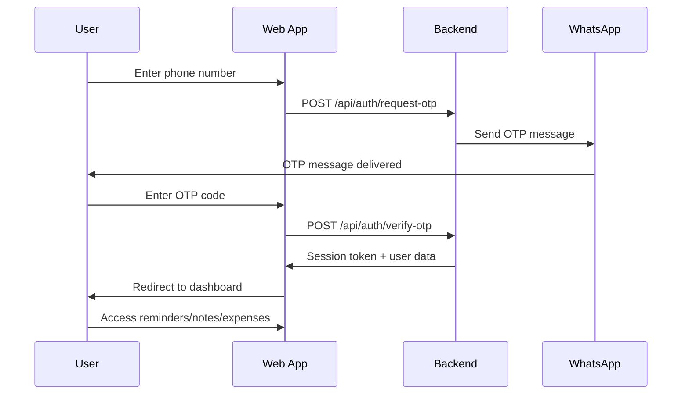
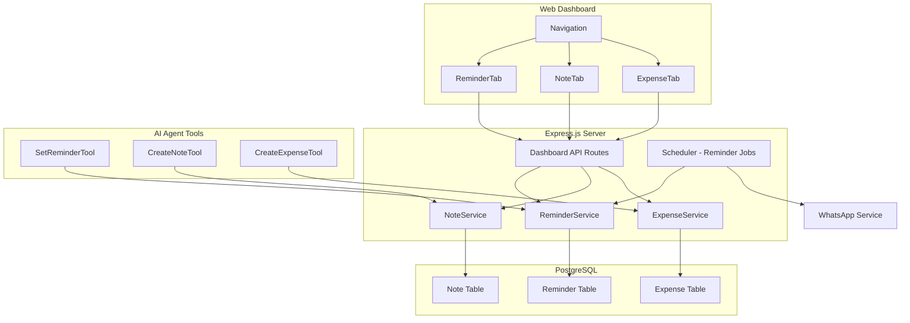

# Implementation Plan: Reminder, Note, and Expense Features

## Overview

This document outlines the implementation plan for adding three new features to the WhatsApp chatbot:
1. **Reminders** - Scheduled reminders with specific date/time and recurring support
2. **Notes** - Text notes with categories/tags for organization
3. **Expenses** - Income/expense tracking with categories and summaries

All features will be **per-user** (each WhatsApp user has their own data) and accessible via:
- WhatsApp chat through AI agent tools
- Web dashboard UI for viewing and management

## Authentication System

### User Authentication Flow

The new features require a **separate authentication system** from the admin dashboard:

- **Admin Dashboard**: Uses master password (existing system)
- **User Apps**: Uses WhatsApp-based one-time passcode (OTP) authentication



### OTP Authentication Details

1. **OTP Generation**: 6-digit numeric code, valid for 5 minutes
2. **Delivery**: Sent via WhatsApp message to the user's phone number
3. **Session**: JWT token valid for 24 hours, stored in HTTP-only cookie
4. **Rate Limiting**: Max 3 OTP requests per phone number per hour

---

## Architecture Overview



---

## 1. Database Schema Design

### 1.0 User Authentication Models

```prisma
model UserSession {
  id          String   @id @default(uuid())
  phoneNumber String   // WhatsApp phone number
  otpCode     String   // 6-digit OTP
  otpExpires  DateTime // OTP expiration time (5 minutes)
  token       String?  // JWT token after verification
  tokenExpires DateTime? // Token expiration (24 hours)
  createdAt   DateTime @default(now())
  updatedAt   DateTime @updatedAt
  
  @@index([phoneNumber])
  @@index([otpCode])
  @@index([token])
}
```

### 1.1 Reminder Model

```prisma
model Reminder {
  id          String         @id @default(uuid())
  userId      String         // WhatsApp phone number or web user ID
  title       String         // Brief reminder title
  description String?        // Optional detailed description
  scheduledAt DateTime       // When to send the reminder
  recurrence  RecurrenceType @default(none)
  recurrenceConfig Json?     // For complex recurrence rules
  status      ReminderStatus @default(pending)
  lastSentAt  DateTime?      // Last time reminder was sent
  nextSendAt  DateTime?      // Next scheduled time for recurring
  createdAt   DateTime       @default(now())
  updatedAt   DateTime       @updatedAt
  
  @@index([userId])
  @@index([status])
  @@index([scheduledAt])
  @@index([nextSendAt])
}

enum RecurrenceType {
  none       // One-time reminder
  daily      // Every day
  weekly     // Every week on same day
  monthly    // Every month on same date
  custom     // Custom recurrence rule in recurrenceConfig
}

enum ReminderStatus {
  pending    // Waiting to be sent
  sent       // One-time reminder sent
  active     // Recurring reminder active
  paused     // Recurring reminder paused
  cancelled  // Reminder cancelled
}
```

### 1.2 Note Model

```prisma
model Note {
  id          String   @id @default(uuid())
  userId      String   // WhatsApp phone number or web user ID
  title       String   // Note title
  content     String   // Note content (text)
  category    String?  // Optional category
  tags        String[] // Array of tags
  isPinned    Boolean  @default(false)
  createdAt   DateTime @default(now())
  updatedAt   DateTime @updatedAt
  
  @@index([userId])
  @@index([category])
  @@index([isPinned])
}
```

### 1.3 Expense Model

```prisma
model Expense {
  id          String        @id @default(uuid())
  userId      String        // WhatsApp phone number or web user ID
  type        ExpenseType   // income or expense
  amount      Float         // Amount in default currency
  description String?       // Optional description
  category    String?       // Category (food, transport, etc.)
  date        DateTime      // Transaction date
  createdAt   DateTime      @default(now())
  updatedAt   DateTime      @updatedAt
  
  @@index([userId])
  @@index([type])
  @@index([category])
  @@index([date])
}

enum ExpenseType {
  income
  expense
}
```

---

## 2. Backend Services

### 2.1 ReminderService

**Location**: `src/services/ReminderService.ts`

**Responsibilities**:
- CRUD operations for reminders
- Scheduling reminders via ActionQueueService
- Processing recurring reminders
- Integration with Scheduler for periodic checks

**Key Methods**:
```typescript
class ReminderService {
  // Create a new reminder
  async createReminder(userId: string, data: CreateReminderDto): Promise<Reminder>
  
  // Get all reminders for a user
  async getReminders(userId: string, filters?: ReminderFilters): Promise<Reminder[]>
  
  // Get single reminder
  async getReminder(id: string): Promise<Reminder | null>
  
  // Update reminder
  async updateReminder(id: string, data: UpdateReminderDto): Promise<Reminder>
  
  // Delete reminder
  async deleteReminder(id: string): Promise<boolean>
  
  // Process due reminders (called by Scheduler)
  async processDueReminders(): Promise<void>
  
  // Calculate next occurrence for recurring reminders
  calculateNextOccurrence(reminder: Reminder): Date
}
```

### 2.2 NoteService

**Location**: `src/services/NoteService.ts`

**Responsibilities**:
- CRUD operations for notes
- Search functionality
- Category/tag management

**Key Methods**:
```typescript
class NoteService {
  // Create a new note
  async createNote(userId: string, data: CreateNoteDto): Promise<Note>
  
  // Get all notes for a user
  async getNotes(userId: string, filters?: NoteFilters): Promise<Note[]>
  
  // Get single note
  async getNote(id: string): Promise<Note | null>
  
  // Update note
  async updateNote(id: string, data: UpdateNoteDto): Promise<Note>
  
  // Delete note
  async deleteNote(id: string): Promise<boolean>
  
  // Search notes by content/title
  async searchNotes(userId: string, query: string): Promise<Note[]>
  
  // Get notes by category
  async getNotesByCategory(userId: string, category: string): Promise<Note[]>
  
  // Get notes by tag
  async getNotesByTag(userId: string, tag: string): Promise<Note[]>
}
```

### 2.3 ExpenseService

**Location**: `src/services/ExpenseService.ts`

**Responsibilities**:
- CRUD operations for expenses
- Summary calculations
- Category-based filtering

**Key Methods**:
```typescript
class ExpenseService {
  // Create a new expense/income entry
  async createExpense(userId: string, data: CreateExpenseDto): Promise<Expense>
  
  // Get all expenses for a user
  async getExpenses(userId: string, filters?: ExpenseFilters): Promise<Expense[]>
  
  // Get single expense
  async getExpense(id: string): Promise<Expense | null>
  
  // Update expense
  async updateExpense(id: string, data: UpdateExpenseDto): Promise<Expense>
  
  // Delete expense
  async deleteExpense(id: string): Promise<boolean>
  
  // Get summary (total income, expense, balance)
  async getSummary(userId: string, period?: DateRange): Promise<ExpenseSummary>
  
  // Get expenses by category
  async getExpensesByCategory(userId: string, category: string): Promise<Expense[]>
  
  // Get monthly breakdown
  async getMonthlyBreakdown(userId: string, year: number, month: number): Promise<MonthlyBreakdown>
}
```

---

## 3. AI Agent Tools

### 3.1 Enhanced SetReminderTool

**Location**: `src/tools/SetReminderTool.ts` (enhance existing)

**New Capabilities**:
- Parse natural language date/time (e.g., "tomorrow at 3pm", "every Monday at 9am")
- Support recurring reminders
- List, update, and cancel reminders

**Parameters**:
```typescript
interface ReminderArgs {
  action: 'create' | 'list' | 'update' | 'delete';
  // For create
  title?: string;
  description?: string;
  scheduled_at?: string;  // ISO date string or natural language
  recurrence?: 'none' | 'daily' | 'weekly' | 'monthly';
  // For list
  status?: 'pending' | 'sent' | 'active' | 'all';
  // For update/delete
  reminder_id?: string;
}
```

### 3.2 CreateNoteTool

**Location**: `src/tools/CreateNoteTool.ts` (new)

**Parameters**:
```typescript
interface NoteArgs {
  action: 'create' | 'list' | 'search' | 'update' | 'delete';
  // For create
  title?: string;
  content?: string;
  category?: string;
  tags?: string[];
  // For search
  query?: string;
  // For update/delete
  note_id?: string;
}
```

### 3.3 CreateExpenseTool

**Location**: `src/tools/CreateExpenseTool.ts` (new)

**Parameters**:
```typescript
interface ExpenseArgs {
  action: 'create' | 'list' | 'summary' | 'update' | 'delete';
  // For create
  type?: 'income' | 'expense';
  amount?: number;
  description?: string;
  category?: string;
  date?: string;  // ISO date string
  // For list
  start_date?: string;
  end_date?: string;
  category_filter?: string;
  // For summary
  period?: 'week' | 'month' | 'year';
  // For update/delete
  expense_id?: string;
}
```

---

## 4. API Routes

### 4.0 Authentication API Routes

**Location**: Add to `src/routes/dashboard.ts` or create new `src/routes/auth.ts`

**Note**: These routes do NOT require admin authentication. They use OTP-based user authentication.

```
POST   /api/auth/request-otp      - Request OTP for phone number (rate limited)
POST   /api/auth/verify-otp       - Verify OTP and get session token
POST   /api/auth/logout          - Logout and invalidate session
GET    /api/auth/me              - Get current user info (requires user auth)
```

**Authentication Middleware**:
- `requireUserAuth` - Middleware to verify user JWT token for protected routes
- Separate from existing `requireAuth` which is for admin dashboard

### 4.1 Reminder API Routes

**Location**: Add to `src/routes/dashboard.ts`

**Note**: All routes require user authentication via `requireUserAuth` middleware.

```
GET    /api/reminders              - List all reminders for user
GET    /api/reminders/:id          - Get single reminder
POST   /api/reminders              - Create new reminder
PUT    /api/reminders/:id          - Update reminder
DELETE /api/reminders/:id          - Delete reminder
GET    /api/reminders/upcoming     - Get upcoming reminders (next 24h)
```

### 4.2 Note API Routes

```
GET    /api/notes                  - List all notes for user
GET    /api/notes/:id              - Get single note
POST   /api/notes                  - Create new note
PUT    /api/notes/:id              - Update note
DELETE /api/notes/:id              - Delete note
GET    /api/notes/search           - Search notes
GET    /api/notes/categories       - Get all categories
GET    /api/notes/tags             - Get all tags
```

### 4.3 Expense API Routes

```
GET    /api/expenses               - List all expenses for user
GET    /api/expenses/:id           - Get single expense
POST   /api/expenses               - Create new expense
PUT    /api/expenses/:id           - Update expense
DELETE /api/expenses/:id           - Delete expense
GET    /api/expenses/summary       - Get expense summary
GET    /api/expenses/categories     - Get expense categories
GET    /api/expenses/monthly       - Get monthly breakdown
```

---

## 5. Frontend Components

### 5.1 ReminderTab Component

**Location**: `frontend/src/components/tabs/ReminderTab.jsx`

**Features**:
- List view of all reminders (upcoming, past, recurring)
- Create new reminder form with date/time picker
- Edit/delete reminders
- Toggle recurring reminders on/off
- Visual indicators for reminder status

**UI Elements**:
```jsx
<ReminderTab>
  <ReminderHeader>
    <Title>Reminders</Title>
    <CreateButton>+ New Reminder</CreateButton>
  </ReminderHeader>
  
  <ReminderFilters>
    <FilterButton active>All</FilterButton>
    <FilterButton>Upcoming</FilterButton>
    <FilterButton>Recurring</FilterButton>
    <FilterButton>Completed</FilterButton>
  </ReminderFilters>
  
  <ReminderList>
    {reminders.map(reminder => (
      <ReminderCard key={reminder.id}>
        <ReminderTime>{formatTime(reminder.scheduledAt)}</ReminderTime>
        <ReminderTitle>{reminder.title}</ReminderTitle>
        <ReminderRecurrence>{recurrenceBadge}</ReminderRecurrence>
        <ReminderActions>
          <EditButton />
          <DeleteButton />
        </ReminderActions>
      </ReminderCard>
    ))}
  </ReminderList>
  
  <ReminderModal>
    <DateTimePicker />
    <RecurrenceSelector />
    <TitleInput />
    <DescriptionInput />
  </ReminderModal>
</ReminderTab>
```

### 5.2 NoteTab Component

**Location**: `frontend/src/components/tabs/NoteTab.jsx`

**Features**:
- List/grid view of notes
- Create/edit notes with title, content, category, tags
- Search functionality
- Filter by category/tag
- Pin important notes
- Sort by date/title

**UI Elements**:
```jsx
<NoteTab>
  <NoteHeader>
    <Title>Notes</Title>
    <SearchBar />
    <CreateButton>+ New Note</CreateButton>
  </NoteHeader>
  
  <NoteFilters>
    <CategoryDropdown />
    <TagFilter />
    <SortDropdown />
  </NoteFilters>
  
  <NoteList>
    {notes.map(note => (
      <NoteCard key={note.id}>
        <NoteTitle>{note.title}</NoteTitle>
        <NoteCategory>{note.category}</NoteCategory>
        <NoteContent>{note.content}</NoteContent>
        <NoteTags>{note.tags.map(tag => <Tag>{tag}</Tag>)}</NoteTags>
        <NoteActions>
          <PinButton />
          <EditButton />
          <DeleteButton />
        </NoteActions>
      </NoteCard>
    ))}
  </NoteList>
  
  <NoteModal>
    <TitleInput />
    <CategorySelect />
    <ContentTextarea />
    <TagsInput />
  </NoteModal>
</NoteTab>
```

### 5.3 ExpenseTab Component

**Location**: `frontend/src/components/tabs/ExpenseTab.jsx`

**Features**:
- List view of all expenses/income
- Summary cards (total income, expenses, balance)
- Create new expense/income entry
- Filter by date range, category, type
- Monthly breakdown chart
- Category breakdown pie chart

**UI Elements**:
```jsx
<ExpenseTab>
  <ExpenseHeader>
    <Title>Expenses & Income</Title>
    <CreateButton>+ New Entry</CreateButton>
  </ExpenseHeader>
  
  <SummaryCards>
    <IncomeCard>
      <Label>Total Income</Label>
      <Amount>{totalIncome}</Amount>
    </IncomeCard>
    <ExpenseCard>
      <Label>Total Expenses</Label>
      <Amount>{totalExpenses}</Amount>
    </ExpenseCard>
    <BalanceCard>
      <Label>Balance</Label>
      <Amount>{balance}</Amount>
    </BalanceCard>
  </SummaryCards>
  
  <ExpenseFilters>
    <DateRangePicker />
    <TypeFilter />
    <CategoryFilter />
  </ExpenseFilters>
  
  <ChartsSection>
    <MonthlyChart />
    <CategoryPieChart />
  </ChartsSection>
  
  <ExpenseList>
    {expenses.map(expense => (
      <ExpenseRow key={expense.id}>
        <ExpenseDate>{formatDate(expense.date)}</ExpenseDate>
        <ExpenseDescription>{expense.description}</ExpenseDescription>
        <ExpenseCategory>{expense.category}</ExpenseCategory>
        <ExpenseAmount type={expense.type}>
          {expense.type === 'income' ? '+' : '-'}{expense.amount}
        </ExpenseAmount>
        <ExpenseActions>
          <EditButton />
          <DeleteButton />
        </ExpenseActions>
      </ExpenseRow>
    ))}
  </ExpenseList>
  
  <ExpenseModal>
    <TypeToggle />
    <AmountInput />
    <DescriptionInput />
    <CategorySelect />
    <DatePicker />
  </ExpenseModal>
</ExpenseTab>
```

---

## 6. Scheduler Integration

### 6.1 Reminder Processing

The existing `Scheduler.ts` will be enhanced to process reminders:

```typescript
// In Scheduler.tick()
private async tick(): Promise<void> {
  // ... existing code ...
  
  // Process due reminders every tick
  await this.processReminders();
}

private async processReminders(): Promise<void> {
  const reminderService = new ReminderService();
  const dueReminders = await reminderService.getDueReminders();
  
  for (const reminder of dueReminders) {
    // Send reminder via ActionQueue
    this.actionQueue.queueMessage(reminder.userId, 
      `⏰ Reminder: ${reminder.title}${reminder.description ? `\n${reminder.description}` : ''}`,
      { priority: 8 }
    );
    
    // Update reminder status
    await reminderService.markAsSent(reminder.id);
    
    // If recurring, calculate next occurrence
    if (reminder.recurrence !== 'none') {
      await reminderService.scheduleNextOccurrence(reminder.id);
    }
  }
}
```

---

## 7. Implementation Order

### Phase 1: Database & Authentication
1. Create Prisma schema models (UserSession, Reminder, Note, Expense)
2. Run database migration
3. Implement AuthService (OTP generation, verification, session management)
4. Create authentication middleware for user routes

### Phase 2: Backend Services
1. Implement ReminderService
2. Implement NoteService
3. Implement ExpenseService

### Phase 3: AI Agent Tools
1. Enhance SetReminderTool
2. Create CreateNoteTool
3. Create CreateExpenseTool
4. Register tools in Agent

### Phase 4: API Routes
1. Add authentication API routes (request-otp, verify-otp, logout, me)
2. Add reminder API routes
3. Add note API routes
4. Add expense API routes

### Phase 5: Frontend Components
1. Create OTP Login Screen component
2. Create ReminderTab component
3. Create NoteTab component
4. Create ExpenseTab component
5. Update App.jsx with user auth flow
6. Create separate routing for user apps vs admin dashboard

### Phase 6: Integration & Testing
1. Test WhatsApp commands
2. Test OTP authentication flow
3. Test web dashboard
4. Test reminder scheduling
5. End-to-end testing

---

## 8. File Structure

```
src/
├── services/
│   ├── AuthService.ts          # NEW - OTP authentication
│   ├── ReminderService.ts      # NEW
│   ├── NoteService.ts          # NEW
│   ├── ExpenseService.ts       # NEW
│   └── ...
├── tools/
│   ├── SetReminderTool.ts      # ENHANCED
│   ├── CreateNoteTool.ts       # NEW
│   ├── CreateExpenseTool.ts    # NEW
│   └── ...
├── routes/
│   ├── dashboard.ts            # EXTENDED with new routes
│   └── auth.ts                 # NEW - user authentication routes
├── middleware/
│   └── userAuth.ts             # NEW - user JWT verification middleware
└── ...

frontend/src/
├── components/
│   ├── OTPLoginScreen.jsx      # NEW - user login via OTP
│   └── tabs/
│       ├── ReminderTab.jsx     # NEW
│       ├── NoteTab.jsx         # NEW
│       ├── ExpenseTab.jsx      # NEW
│       └── ...
├── hooks/
│   └── useUserAuth.js          # NEW - user authentication hook
└── ...

prisma/
└── schema.prisma               # EXTENDED with new models
```

---

## 9. Dependencies

No new external dependencies required. The implementation uses:
- Existing Prisma ORM for database
- Existing Express.js for API routes
- Existing React + Tailwind CSS for frontend
- Existing ActionQueueService for reminder scheduling
- Existing WhatsAppService for OTP delivery

Additional dependencies for JWT (if not already present):
- `jsonwebtoken` - For generating/verifying JWT tokens
- `@types/jsonwebtoken` - TypeScript types

---

## 10. Security Considerations

1. **User Isolation**: All data is scoped to `userId` (WhatsApp phone number)
2. **Dual Authentication**:
   - Admin dashboard: Master password (existing)
   - User apps: OTP via WhatsApp (new)
3. **OTP Security**:
   - 6-digit codes, valid for 5 minutes
   - Rate limiting: Max 3 requests per phone number per hour
   - OTPs are hashed in database
4. **Session Security**:
   - JWT tokens with 24-hour expiration
   - HTTP-only cookies to prevent XSS
   - Tokens stored securely
5. **Input Validation**: All inputs validated before database operations
6. **Rate Limiting**: Reminder creation and OTP requests limited to prevent abuse

---

## 11. Future Enhancements

1. **Reminders**:
   - Smart suggestions based on conversation context
   - Timezone support
   - Snooze functionality

2. **Notes**:
   - Markdown support
   - Note sharing between users
   - Attachments

3. **Expenses**:
   - Multi-currency support
   - Export to CSV/PDF
   - Budget goals and alerts
   - Receipt image attachments